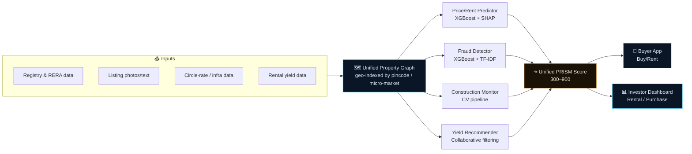
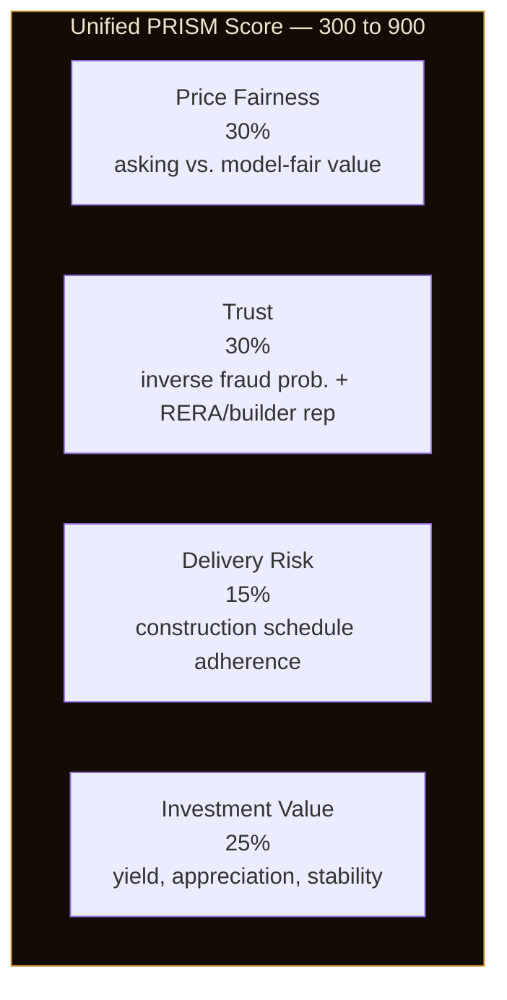
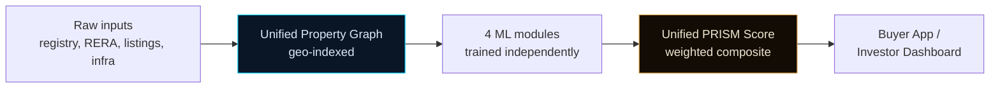

<div align="center">

# 🏠 PRISM
### Property Risk, Intelligence, Score & Monitoring

**A decision-support platform for Indian residential real estate — a unified property graph, four ML modules, and a single bureau-style PRISM Score, feeding two audience-specific surfaces.**


</div>

---

## 🖥 What you're looking at



---

## ⭐ Unified PRISM Score

The centerpiece: every property gets **one bureau-style score (300–900)**, combining four weighted components computed from the graph and the four ML modules feeding into it.



**Bands:** Excellent (750+) · Good (650–749) · Fair (550–649) · Needs Review (<550)

The score is deliberately calibrated to discriminate rather than cluster everyone at the top: fair value is a clean function of features with no seller markup baked in, while listings carry a realistic asking-price markup (roughly -3% to +12%) — so price fairness actually varies across listings instead of trivially matching by construction. Price Fairness is computed separately for the sale-side and rent-side listing when both exist.

---

## 📊 Feature Map

| Module | Approach | Key metric |
|---|---|---|
| 💰 **Price Prediction** | XGBoost regressor, pincode/micro-market/property-type features, SHAP explainability | MAPE 4.9%, R² 0.99 |
| 🏘 **Rent Prediction** | Same feature schema, separate model trained on rentable inventory | MAPE 20.7%, R² 0.85 |
| 📈 **Rental Yield & Investment Recommender** | Risk-profile scoring + collaborative filtering (SVD) | 4 investor personas |
| 🏗 **Construction Progress Monitoring** | Classical CV feature extraction + Random Forest classifier | 5-stage classification |
| 🚩 **Fraud Detection in Listings** | XGBoost classifier + TF-IDF/structural duplicate detection | AUC ~0.99, sale + rent listings |

> Rent prediction carries a meaningfully higher MAPE than sale price — this mirrors real rental markets, where landlord-level idiosyncrasy adds noise that locality/property features alone don't fully explain, unlike sale prices which track circle-rate anchors more tightly.

---

## 🗺 Coverage

- **18 cities** across Tier 1 (Mumbai, Bangalore, Delhi NCR, Chennai, Hyderabad, Pune, Kolkata, Ahmedabad), Tier 2 (Jaipur, Lucknow, Chandigarh, Indore, Kochi, Surat), and Tier 3 (Bhubaneswar, Raipur, Ranchi, Dehradun)
- **68 micro-markets**, **7 property types** (Apartment, Villa, Independent House, Penthouse, Studio/1RK, Row House, Plot/Land)
- **5,440 properties**, **~8,400 listings** split across sale and rental markets

---

## 🖱 Surfaces

| Surface | Highlights | Stack |
|---|---|---|
| 🏡 **Buyer App** | Single-property lookup, Buy/Rent toggle, property-type filter, plain-language score breakdown for whichever mode is selected | Streamlit |
| 📊 **Investor Dashboard** | Rental Income view (yield/rent-trust weighted) + Purchase/Appreciation view (appreciation/price-fairness/delivery weighted) | Streamlit |
| 🔍 **Module deep-dives** | Sidebar pages 3–6 — each underlying model explorable on its own | Streamlit |

---

## 🚀 Quick Start

```bash
pip install -r requirements.txt

# regenerate data (optional — CSVs are already included)
python data/generate_locality_data.py
python data/generate_listings_data.py

# retrain models (optional — .joblib files are already included)
python models/price_model.py
python models/fraud_model.py
python models/construction_monitor.py
python models/yield_recommender.py
python models/unified_graph.py

# launch the app
streamlit run app.py
```

---

## 📁 Repository Structure

```
prism/
├── app.py                          # Home dashboard
├── pages/
│   ├── 1_Buyer_App.py              # Buy/Rent property lookup
│   ├── 2_Investor_Dashboard.py     # Rental income + purchase/appreciation views
│   ├── 3_Price_Prediction.py       # Price/rent model deep-dive
│   ├── 4_Rental_Yield.py           # Yield recommender deep-dive
│   ├── 5_Construction_Monitoring.py# Construction CV deep-dive
│   └── 6_Fraud_Detection.py        # Fraud model deep-dive
├── data/                           # Generators + generated CSVs
├── models/                         # Training scripts + saved .joblib models
├── utils/styling.py                # Shared visual identity
└── README.md
```

---

## 🏗 Architecture Notes



- **Graph-first design** — a single geo-indexed property graph (pincode / micro-market) feeds all four models, so they share one consistent view of location, rather than each module querying inputs independently.
- **Independent module training** — price/rent, fraud, construction, and yield are separate models with different algorithms (XGBoost, Random Forest, SVD) rather than one monolithic model, so each can be retrained or swapped without touching the others.
- **Score as the integration layer** — the four modules never talk to each other directly; they only meet at the weighted Unified PRISM Score, which keeps the scoring logic auditable and each module's contribution explicit.
- **Scoped-down construction module** — classical CV feature extraction stands in for a transfer-learned CNN; the build environment had no GPU and ran out of disk space installing a deep-learning framework, so the module was intentionally scoped down rather than faked.

---

## 🧰 Tech Stack

<div align="center">

| Layer | Technology | Used for |
|---|---|---|
| App framework |  | Multipage app — home, buyer, investor, 4 deep-dive pages |
| Language |  | Data generation, model training, orchestration |
| Price/Fraud models |  | Price/rent regression, fraud classification |
| Explainability |  | Feature attribution for price predictions |
| Text similarity |  | Structural duplicate/fraud detection in listing text |
| Construction CV |  | 5-stage construction classification from procedural imagery |
| Yield recommender | -2E86AB) | Investor-persona yield/investment matching |
| Data |  | Property graph, feature tables, generated CSVs |
| Persistence |  | Saved trained models (`.joblib`) |

</div>

---

## 🧭 Data Methodology & Known Limitations

- **All data is synthetic**, generated to be calibrated to real, publicly available regulatory anchors rather than claimed as real transaction records — bulk registered-transaction data isn't available via a single public API in India (it's fragmented across state sub-registrar and RERA portals), so prices are calibrated to realistic Ready Reckoner/circle-rate bands per locality instead.
- **Regulatory patterns are real** — RERA registration patterns, builder tiers, stamp duty rates by state, and amenity premium structures are modeled on real, publicly documented norms.
- **Fraud labels are synthetic** — built by injecting realistic fraud patterns onto the synthetic listing base, not sourced from real fraud cases.
- **Construction imagery is procedurally generated**, not real drone/satellite photos; classical CV feature extraction stands in for a transfer-learned CNN due to build-environment constraints (no GPU, insufficient disk space for a deep-learning framework).
- **This is a methodology demonstration** — treat PRISM as a demonstration of modeling methodology and system architecture, **not** a real property valuation, fraud detection, or investment tool.

<div align="center">

---

*Built with Streamlit · XGBoost · SHAP · scikit-learn · pandas*

</div>
