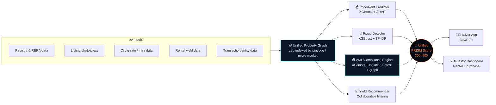
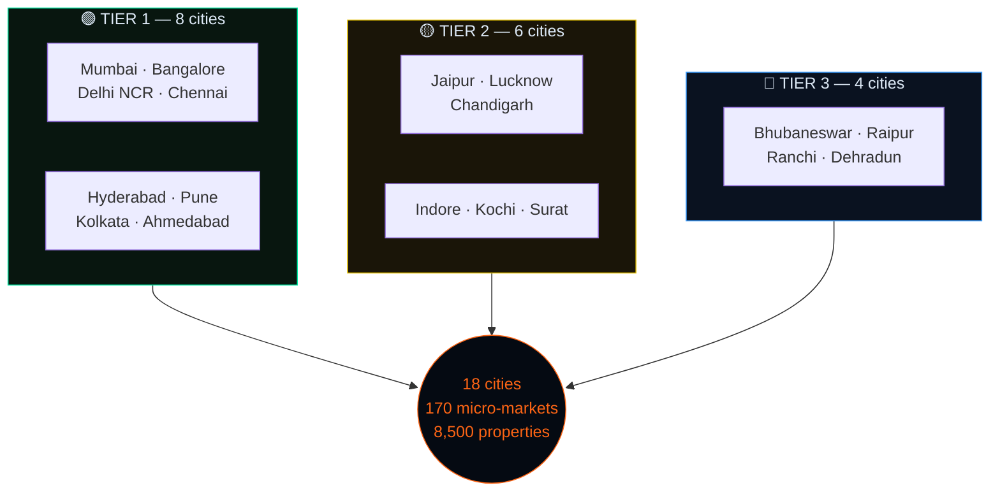
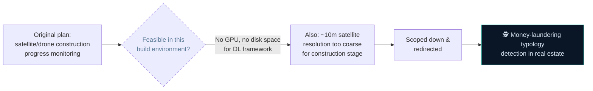
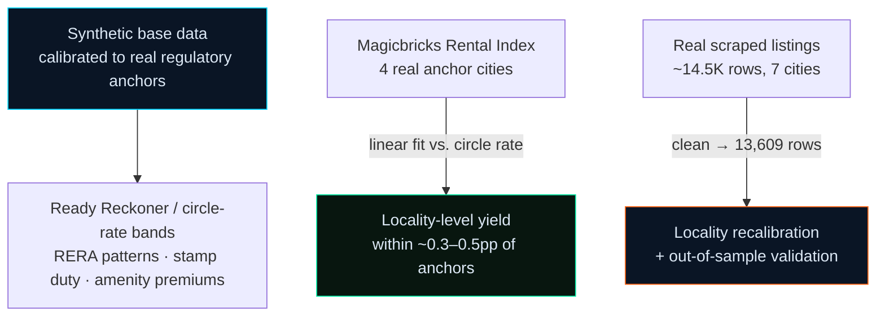

<div align="center">

# 🏠 PRISM
### Property Risk, Intelligence, Score & Monitoring

**A decision-support platform for Indian residential real estate — one unified property graph, four independently-trained ML modules, and a single bureau-style PRISM Score (300–900) feeding two audience-specific apps.**


</div>

---

## 🖥 What you're looking at



Every property in the system funnels through one graph and one score — but the score is deliberately built from **four independently trained modules**, not one model wearing four hats. That separation matters: a listing can be a genuine bargain and still fail an AML check, or look fairly priced and still be a fraudulent listing. PRISM keeps those signals apart until the final weighted blend.

---

## 🗺 Coverage



**~13,000 listings** across sale and rental markets, spanning **7 property types** (Apartment, Villa, Independent House, Penthouse, Studio/1RK, Row House, Plot/Land), each with an associated transaction/entity record for AML analysis.

---

## 🧩 Modules

| Module | Approach | Key metric |
|---|---|---|
| 💰 **Price Prediction** | XGBoost regressor · pincode/micro-market/property-type features · SHAP explainability | MAPE **4.9%**, R² **0.99** |
| 🏘 **Rent Prediction** | Same feature schema, separate model trained on rentable inventory | MAPE **20.7%**, R² **0.85** |
| 📈 **Rental Yield & Investment Recommender** | Risk-profile scoring + collaborative filtering (SVD), calibrated to the Magicbricks Rental Index | 4 investor personas |
| 🕵️ **AML & Transaction Structuring Risk** | XGBoost classifier + Isolation Forest anomaly detection + graph-based ring detection (NetworkX) | AUC **0.996**, 8 rings detected |
| 🚩 **Fraud Detection in Listings** | XGBoost classifier + TF-IDF/structural duplicate detection | AUC **~0.99**, sale + rent listings |

> Rent prediction carries a meaningfully higher MAPE than sale price by design, not by weakness — real rental markets carry landlord-level idiosyncrasy that locality/property features alone can't fully explain, while sale prices track circle-rate anchors much more tightly.

---

## 🕵️ Why AML/Compliance instead of construction monitoring



Real estate is a globally recognized laundering channel — FATF flags it as high-risk — and Indian law gives this real regulatory teeth: **PMLA 2002** requires reporting entities to flag suspicious transactions to FIU-IND, **Income Tax Act §269SS/269ST** effectively caps cash consideration for property deals, and **RBI/NHB KYC master directions** require beneficial-ownership verification for non-individual buyers.

The module mirrors how a real bank AML function actually works, in three complementary layers:

1. **Supervised classifier** (XGBoost) — trained on 5 known typologies: undervaluation, rapid flips, high cash components, shell-entity buyers, structuring/smurfing
2. **Unsupervised anomaly detection** (Isolation Forest) — run independently of any label to catch novel deviations the typologies don't cover (correlates ~0.70 with the label despite never seeing it)
3. **Graph-based ring detection** (NetworkX strongly-connected-components) — surfaces circular trading rings, a pattern invisible from any single transaction's features and only visible in network structure

---

## 🎯 Unified PRISM Score

```mermaid
flowchart LR
    A["💵 Price Fairness<br/>30%"] --> SCORE
    B["🛡 Trust<br/>30%"] --> SCORE
    C["🕵️ Compliance Risk<br/>15%"] --> SCORE
    D["📈 Investment Value<br/>25%"] --> SCORE
    SCORE(("PRISM Score<br/>300–900"))

    SCORE --> R1["Excellent<br/>750+"]
    SCORE --> R2["Good<br/>650–749"]
    SCORE --> R3["Fair<br/>550–649"]
    SCORE --> R4["Needs Review<br/><550"]

    style SCORE fill:#050a12,stroke:#fb6415,color:#fb6415
    style R1 fill:#08160f,stroke:#00e5a0
    style R4 fill:#1a0808,stroke:#ff4d4d
```



| Component | Weight | What it measures |
|---|---|---|
| **Price Fairness** | 30% | Asking price/rent vs. model-fair value, computed separately for the sale-side and rent-side listing when both exist |
| **Trust** | 30% | Inverse listing-fraud probability + RERA/builder reputation |
| **Compliance Risk** | 15% | Inverse AML/transaction-structuring risk probability |
| **Investment Value** | 25% | Locality yield, appreciation, stability |

**Trust and Compliance are deliberately separate checks** — Trust asks *"is this listing genuine"* (fraud on the ad itself), while Compliance asks *"is the money behind this transaction clean"* (AML on the underlying registered sale). A listing can pass one and fail the other.

The score is calibrated to discriminate, not cluster everyone at the top: fair value is a clean function of features with no markup baked in, while real listings carry a realistic asking-price markup (roughly **−3% to +12%**) — so price fairness genuinely varies across listings rather than trivially matching by construction.

---

## 📱 Surfaces

| Surface | What it shows |
|---|---|
| 🧑‍💼 **Buyer App** | Single-property lookup, Buy/Rent toggle, property-type filter, plain-language score breakdown for the selected mode |
| 📊 **Investor Dashboard** | Two dedicated views — **Rental Income** (yield/rent-trust weighted) and **Purchase/Appreciation** (appreciation/price-fairness/compliance weighted) |
| 🔍 **Module deep-dives** | Sidebar pages 3–5, each underlying model explorable on its own — including a force-directed network graph for the AML ring-detection layer |

---

## 🔬 Data Methodology



**All data in this project is synthetic**, but calibrated — not invented from nothing. Bulk registered-transaction data isn't available via a single public API in India (it's fragmented across state sub-registrar and RERA portals), so prices are calibrated to realistic Ready Reckoner/circle-rate bands per locality instead. RERA registration patterns, builder tiers, stamp duty rates by state, and amenity premium structures are modeled on real, publicly documented norms. Listing-fraud and AML-transaction labels are both synthetic, built by injecting realistic typologies onto the synthetic base.

### Grounded against two real external sources

**1. Rental yield ↔ Magicbricks Rental Index (Jan–Mar 2026)**
Four cities' trailing rental yields — Chennai (4.87%), Kolkata (4.81%), Bengaluru (4.19%), Hyderabad (4.06%) — were fit with a simple linear regression:

```
yield_pct = 6.35 − 0.00019 × circle_rate_per_sqft
```

Applied locality-by-locality using each locality's own circle rate, this reproduces the anchor cities' actual yields within ~0.3–0.5pp and preserves the intra-city premium/affordable spread the anchors imply. The same report's qualitative commentary (Bengaluru/Hyderabad in "strong momentum," NCR/Mumbai past a demand surge into a softer, more volatile phase) sets a per-city yield-volatility multiplier. This is scoped to yield only — rent growth and sale-price appreciation are separate metrics and are kept separate.

**2. Sale prices ↔ real scraped listings** (`data/raw_real_estate_listings.csv`, ~14.5K rows across Bengaluru, Pune, Delhi NCR, Chennai, Kolkata, Mumbai, Hyderabad; 13,609 rows after cleaning)

| Use | How |
|---|---|
| **Locality recalibration** | 37 curated localities with ≥10 matching real listings get their illustrative circle-rate band replaced with one derived from the real data's own 25th–75th percentile price/sqft — deflated by ~1.337× (the generator's own measured average combined premium) so the generator's markup *reconstructs* the real price level instead of compounding on top of it |
| **Out-of-sample validation** | The trained sale-price model (never exposed to this data) is scored against all 13,609 real listings, with missing fields filled from the synthetic training data's own feature averages, and unmatched localities falling back to the real data's city-level median (also deflated by 1.337×) rather than PRISM's own curated average, to avoid skewing toward better-known neighborhoods |

Results are shown live on the Price Prediction page's **"Real-World Validation"** tab.

> ⚠️ **Treat this project as a demonstration of modeling methodology and system architecture** — not a real property valuation, fraud detection, AML screening, or investment tool.

---

## 🚀 Quick Start

```bash
pip install -r requirements.txt

# clean the real scraped-listings dataset first (feeds locality calibration)
python data/clean_real_estate_data.py

# regenerate synthetic data (optional — CSVs are already included)
python data/generate_locality_data.py
python data/generate_listings_data.py
python data/generate_transactions_data.py

# retrain models (optional — .joblib files are already included;
# price_model.py also runs real-world validation, see console output)
python models/price_model.py
python models/fraud_model.py
python models/aml_risk.py
python models/yield_recommender.py
python models/unified_graph.py

# launch the app
streamlit run app.py
```

Python 3.10+.

---

## 📁 Repository Structure

```
prism/
├── app.py                          # Home dashboard
├── pages/
│   ├── 1_Buyer_App.py              # Buy/Rent property lookup
│   ├── 2_Investor_Dashboard.py     # Rental income + purchase/appreciation views
│   ├── 3_Price_Prediction.py       # Price/rent model deep-dive
│   ├── 4_AML_Compliance.py         # AML/transaction structuring risk deep-dive
│   └── 5_Fraud_Detection.py        # Listing fraud model deep-dive
├── data/                           # Generators + generated CSVs + real listings/calibration
├── models/                         # Training scripts + saved .joblib models
│                                    #   (price_model.py includes real-world validation)
├── utils/
│   ├── styling.py                  # Shared visual identity
│   ├── charts.py                   # Reusable chart helpers (gauge, radar, map, network graph)
│   └── geo.py                      # Real city coordinates for map visuals
└── README.md
```

---

## 🧰 Tech Stack

<div align="center">

| Layer | Technology | Used for |
|---|---|---|
| App framework |  | Multi-page dashboard, sidebar, widgets, caching |
| Language |  | Modeling, data generation, orchestration |
| Gradient boosting |  | Price/rent regression, fraud & AML classification, native SHAP explainability |
| Classical ML |  | Isolation Forest anomaly detection, SVD collaborative filtering |
| Graph algorithms |  | Strongly-connected-component ring detection, unified property graph |
| Data |   | DataFrames, numeric ops, calibration math |

</div>

### External data sources

<div align="center">

 

</div>

---

## 🧭 Known Limitations

- **All core data is synthetic** — calibrated to real regulatory anchors and a real scraped-listings dataset, but not itself a record of real transactions. Bulk Indian registered-transaction data has no single public API to draw from.
- **Rent prediction is noisier than price prediction by nature** (MAPE 20.7% vs. 4.9%) — landlord-level idiosyncrasy in rental markets isn't fully captured by locality/property features alone.
- **Locality recalibration and validation only cover 7 cities** with real scraped listings; the remaining 11 cities rely entirely on circle-rate-calibrated synthetic bands.
- **Fraud and AML labels are synthetic-by-injection** — realistic typologies layered onto synthetic data, not sourced from real adjudicated cases.
- This is a **methodology and architecture demonstration**, not a certified valuation, fraud, AML, or investment product — see the Data Methodology section above.

---

## 📄 License

Released under the MIT License — free to use, modify, and distribute, including commercially, with attribution and no warranty.

<div align="center">

---

*Built with XGBoost · scikit-learn · NetworkX · Streamlit*

</div>
